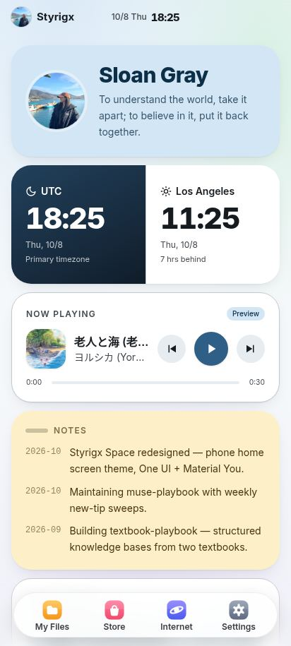
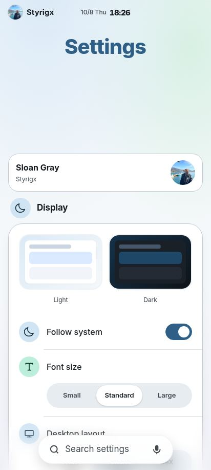
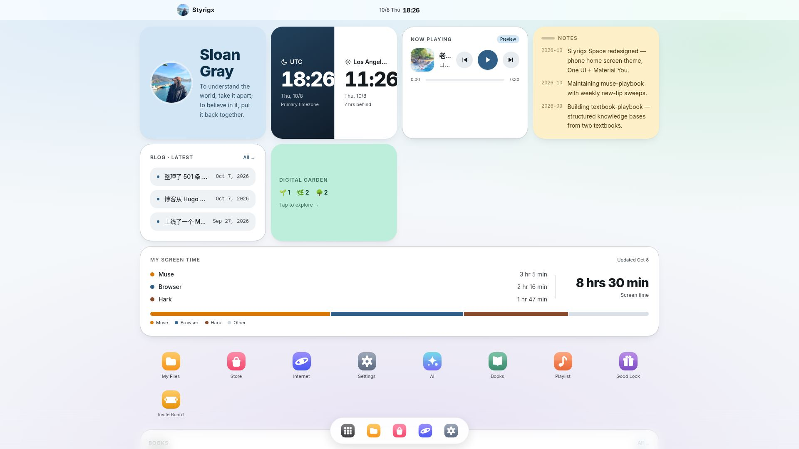

<div align="center">

[中文](README.md) | English

# Styrigx's Space

To understand the world, take it apart; to believe in it, put it back together.

[Visit styrigx.com](https://styrigx.com) · [Blog blog.styrigx.com](https://blog.styrigx.com) · [GitHub @styrigx](https://github.com/styrigx) · [X @styrigx](https://x.com/styrigx)


</div>

---

## What is this

My personal homepage, built to feel like a Samsung phone. Posts, books, music and the sites I use live as apps on the home screen. The interface is Styrigx UI, my own take on One UI 8.5, and it works on phone, tablet and DeX.

## Preview

|  |  |
|---|---|
| Home | Settings |


DeX

## Structure

| App | Path | What it is |
|---|---|---|
| Home | `/en/` | Launcher: app icons, widgets and the Dock. Widgets include profile card, dual clocks, music, weather, Now notes, latest blog posts, digital garden, screen time, bookshelf, playlist and collections. |
| My Files | `/en/files/` | Only things I wrote: posts, books, music, blog, library. |
| Store | `/en/store/` | Apps with other people involved: AI, bookshelf, playlist, Good Lock, invite board; can be shown / hidden. |
| Internet | `/en/browser/` | External sites and bookmarks, switchable search engines, voice search. |
| Settings | `/en/settings/` | Display, language, layout and other system settings, stored locally. |

The Dock only shows on the home screen; inside apps only the search bar stays at the bottom.

## A few Styrigx UI details

- Two layouts: phone (<640px) and DeX (≥640px).
- Light / dark follows the system by default.
- Large titles collapse into the top-bar mini title on scroll.
- The bottom search capsule supports voice input (Chrome and Samsung Internet).
- Two full versions: 中文 / English.

## Run locally

Requirements: Hugo extended 0.162.0, Node.js (CI uses 20, needed to build Tailwind).

```bash
git clone https://github.com/styrigx/styrigx-space.git
cd styrigx-space
npm install
npm run build:css
hugo server
```

Open http://localhost:1313 in a browser. Build with `hugo --minify`.

Pushing to main auto-deploys to Cloudflare Pages (the Pages project keeps its historic name `styrigx-portal`).

## Directories

- `content/`: page entries, bilingual.
- `data/`: content data, split by language (`data/en/` is the English version; `data/wellbeing.yaml` holds screen-time data).
- `layouts/`: templates; `_default/` holds each app page.
- `assets/`: `css/input.css` is the Tailwind input, `main.css` is generated at build; shared JS lives here too.
- `static/`: `_redirects` short links, `_headers` cache headers, images.

## License

Code is MIT; personal content (posts, images, avatar, etc.) is all rights reserved.

© 2020–2026 Sloan Gray · Powered by Styrigx UI
