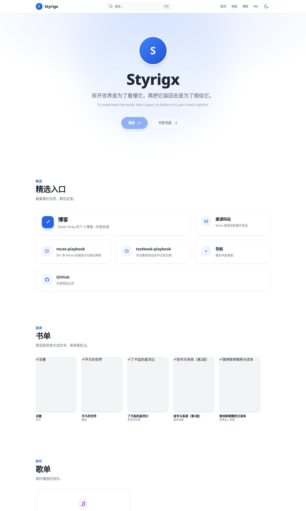
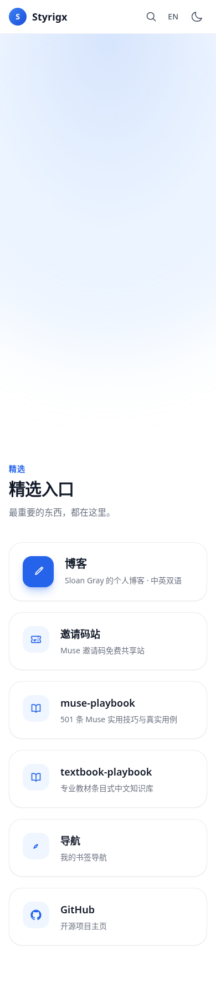

<div align="center">

# Styrigx

**To understand the world, take it apart; to believe in it, put it back together.**

*拆开世界是为了了解它，再把它装回去是为了相信它。*

[中文](README.md) | [English](README.en.md)


</div>

---

## 🖼️ Screenshots

<picture>
  <source media="(prefers-color-scheme: dark)" srcset=".github/assets/desktop-dark.png">
  
</picture>



---

## 🌱 What is this

Not a blog, and more than a bookmark page — this is a **digital-garden-style personal portal**.

---

## 🧩 Sections

- 🏠 **Hero** — Big title, radial gradient, bilingual motto, two call-to-action buttons (Blog / Links)
- ✨ **Featured** — Bento grid, the blog card takes the large cell; the important stuff, at a glance
- 📚 **Bookshelf** — Real cover wall, hover to read my notes
- 🎵 **Playlist** — Music on repeat (work in progress)
- 🌿 **Garden** — A digital garden: 🌱 seedling / 🌿 growing / 🌳 evergreen, with tag filters and my annotations
- 📍 **Now** — What I'm up to lately
- 🧭 **/links** — WebStack-style bookmark navigation with a category sidebar and instant search

---

## 📐 Classification rules (where new entries go)

Decide where new content belongs using these rules:

- **Store**: multi-user services (e.g. the invite board).
- **My Files**: only I write, only I have access (site files, blog, future library).
- **Internet**: external platforms, including my profiles on them (GitHub, X).

---

## ⚡ Features

- ⌘K / Ctrl+K instant site-wide search (bookmarks, books, music, garden)
- Bilingual (Chinese / English); theme follows the system by default, overridable in Settings (`color-scheme: light dark`, so browsers don't force-recolor the page)
- Minimal top bar: avatar + Styrigx, search, settings; language and theme live in `/settings/` only
- Mobile-first, no horizontal scrolling
- Pure static, no heavy frameworks — hand-written Hugo + Tailwind
- All content driven by `data/*.yaml`; edit a data file and you're done
- Fingerprinted CSS (hashed filenames) + tiered cache strategy
- Custom 404 page

---

## 🔗 Short links

Powered by `static/_redirects` (native Cloudflare Pages support):

| Short link | Goes to |
|---|---|
| `styrigx.com/mp` | muse-playbook repo |
| `styrigx.com/tp` | textbook-playbook repo |
| `styrigx.com/gh` | GitHub profile |
| `styrigx.com/gh/<repo>` | the matching repo |

To add a new repo, just append one line to `_redirects`.

---

## 🛠️ Stack

Hugo (v0.162.0 extended) + Tailwind CSS (v3.4.19) + Cloudflare Pages

## 📊 Updating screen time

The "Digital wellbeing" widget on the homepage reads from `data/wellbeing.yaml`:

```yaml
updated: "2026-10-08"   # update date
total_minutes: 510      # total (minutes)
apps:
  - key: muse
    zh: "Muse"          # Chinese name
    en: "Muse"          # English name
    minutes: 185        # duration (minutes)
    color: "#d97706"    # segment color in the progress bar
```

Edit, commit and push — the homepage updates on the next build (total and the "Other" segment are computed automatically).

## 📁 Structure

```
├── layouts/        # Templates: home, 404, links page, icon partial
├── assets/css/     # Compiled Tailwind CSS (fingerprinted by Hugo Pipes)
├── data/           # Content data: books, music, garden, links, now, profile
├── content/        # Page content (bilingual)
├── static/         # _redirects (short links), _headers (cache policy), images
└── .github/        # Actions deploy workflow, README screenshot assets
```

---

## 💻 Run locally

Requires [Hugo](https://gohugo.io/) extended (v0.162.0):

```bash
hugo server
```

Then open http://localhost:1313 .

CSS comes pre-compiled in `assets/css/`, so editing templates and data needs no npm.

---

## 🙏 Credits

Visual inspiration from:

- [HugoBlox](https://hugoblox.com) — colors and feel
- [Blowfish](https://blowfish.page) — gallery and navbar
- [Hugo Profile](https://github.com/gurusabarish/hugo-profile) — Now section
- [WebStack-Hugo](https://github.com/shenweiyan/WebStack-Hugo) — bookmark navigation page
- [Maggie Appleton](https://maggieappleton.com/garden) — the digital garden

---

## 🗺️ Roadmap

- [ ] Replace placeholder assets (avatar, playlist covers)
- [ ] Complete the playlist
- [ ] Extract into an open-source Hugo theme

---

## 📄 License

**Code** is open source under the [MIT License](LICENSE).

**Personal content** is all rights reserved: the motto, book notes, data files under `data/`, avatar and images are Sloan Gray's personal content — please don't republish without permission.

---

<div align="center">

[Blog](https://blog.styrigx.com) · [X](https://x.com/styrigx) · [GitHub](https://github.com/styrigx)

*Yellow earth beneath, green light ahead.*

</div>
