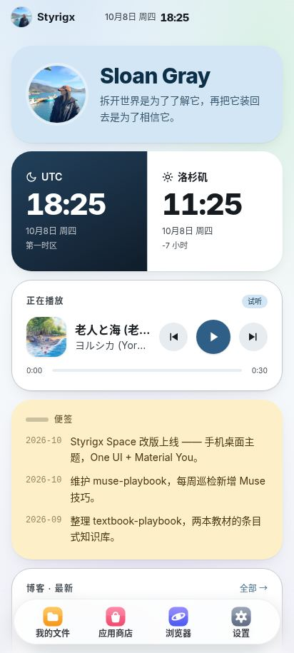
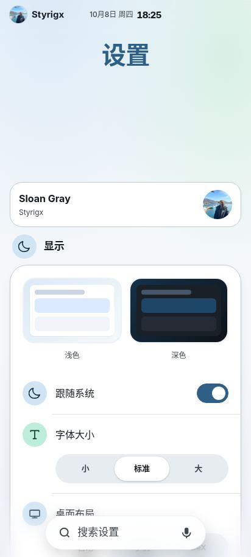
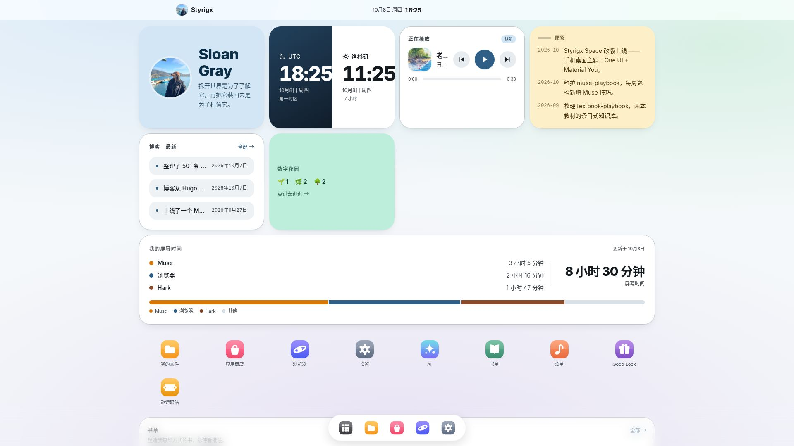

<div align="center">

中文 | [English](README.en.md)

# Styrigx's Space

拆开世界是为了了解它，再把它装回去是为了相信它。

[在线访问 styrigx.com](https://styrigx.com) · [博客 blog.styrigx.com](https://blog.styrigx.com) · [GitHub @styrigx](https://github.com/styrigx) · [X @styrigx](https://x.com/styrigx)


</div>

---

## 这是什么

我的个人主页，长得像一台三星手机。文章、书、音乐和常用的站点都是桌面上的 App，点开就能用。界面叫 Styrigx UI，参考 One UI 8.5 自己写的，手机、平板和 DeX 都能打开。

## 预览

|  |  |
|---|---|
| 手机主页 | 设置 |


DeX

## 结构

| 应用 | 路径 | 是什么 |
|---|---|---|
| 主页 | `/` | 启动页：应用图标、小组件和 Dock。小组件有名片、双时钟、音乐、天气、Now 便签、博客最新、数字花园、屏幕时间、书单、歌单和收藏。 |
| 我的文件 | `/files/` | 只放我自己写的东西：文章、书、音乐、博客、书库。 |
| 应用商店 | `/store/` | 多人参与的应用：AI、书单、歌单、Good Lock、邀请码站，可显示 / 隐藏。 |
| 浏览器 | `/browser/` | 外部站点和书签，可切换搜索引擎，支持语音搜索。 |
| 设置 | `/settings/` | 显示、语言、布局等系统设置，偏好存在本地。 |

Dock 只在主页显示；进入应用后底部只留搜索栏。

## Styrigx UI 的几个细节

- 两种布局：手机（<640px）和 DeX（≥640px）。
- 浅色 / 深色默认跟随系统。
- 大标题随滚动折叠成顶栏小标题。
- 底部搜索胶囊支持语音输入（Chrome 和三星浏览器）。
- 中文 / English 两套页面。

## 本地运行

环境要求：Hugo extended 0.162.0、Node.js（CI 用 20，构建 Tailwind 需要）。

```bash
git clone https://github.com/styrigx/styrigx-space.git
cd styrigx-space
npm install
npm run build:css
hugo server
```

浏览器打开 http://localhost:1313。构建用 `hugo --minify`。

推送 main 后自动部署到 Cloudflare Pages（Pages 项目名沿用历史名称 `styrigx-portal`）。

## 目录说明

- `content/`：页面入口，中英双语。
- `data/`：内容数据，中英分开（`data/en/` 是英文版；`data/wellbeing.yaml` 是屏幕时间数据）。
- `layouts/`：模板，`_default/` 下是各 App 页面。
- `assets/`：`css/input.css` 是 Tailwind 输入，`main.css` 由构建生成；公共 JS 也在这里。
- `static/`：`_redirects` 短链、`_headers` 缓存头、图片。

## 许可

代码 MIT；文章、图片、头像等个人内容保留所有权利。

© 2020–2026 Sloan Gray · Powered by Styrigx UI
