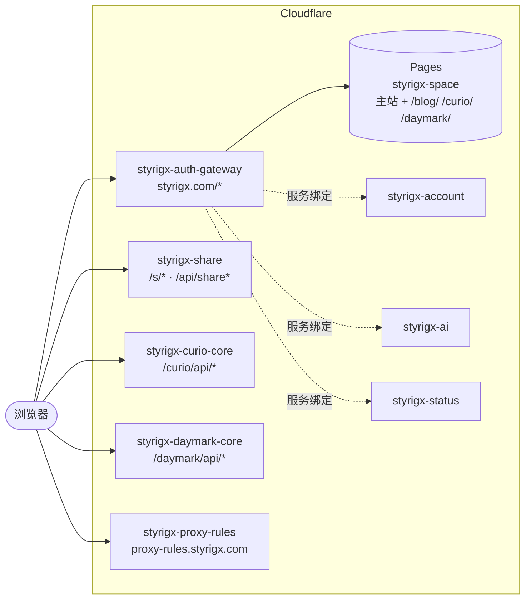

<div align="center">

中文 | [English](README.en.md)

# Styrigx's Space

**拆开世界是为了了解它，再把它装回去是为了相信它。**

Sloan Gray 的个人门户：主页、聊天、设置与账号，以及守住整个站点家族的鉴权网关。

[styrigx.com](https://styrigx.com) · [博客 styrigx.com/blog/zh/](https://styrigx.com/blog/zh/) · [GitHub @styrigx](https://github.com/styrigx) · [X @styrigx](https://x.com/styrigx)


</div>

---

## 目录

- [概览](#概览)
- [预览](#预览)
- [应用](#应用)
- [架构](#架构)
- [安全模型](#安全模型)
- [Styrigx UI](#styrigx-ui)
- [本地开发](#本地开发)
- [测试与 CI](#测试与-ci)
- [仓库结构](#仓库结构)
- [站点家族](#站点家族)
- [许可](#许可)

## 概览

这是 styrigx.com 的源码仓库，也是整个站点家族的「系统仓库」：

- **门户**：主页、聊天、设置、账号四个应用，中英双语。
- **鉴权网关**：主站和子站（博客、奇趣、日刻，在 `styrigx.com/<站>/`）的每个页面、每个接口都先经过它。全站上锁是设计本身，对外分享只用带临时钥匙的短链。
- **共享外壳**：顶栏、快捷面板、AI 窗口等四站共用；子站和主站是同一个 Hugo 站，直接用同一份模板和脚本，没有副本。
- **共享 CI**：Hugo、Node、Playwright 的安装步骤以 composite action 形式发布（`v*` tag），图志按 tag 引用。

界面是自研的 **Styrigx UI**，版本号与 One UI 对齐；内核 **SGX** 管登录与会话。手机、平板和 DeX 都能用，体验接近一台三星手机。

## 预览

|  |  |
|:---:|:---:|
| 手机旷野页（上） | 旷野页分类入口 |


<p align="center">DeX</p>

## 应用

| 应用 | 路径 | 说明 |
|---|---|---|
| 旷野 | `/zh/`（英文 `/`，默认） | 主站唯一的顶级页（主页和设置合一）：名片、日刻「今日一句」、屏幕时间，下面平铺各分类入口——风格 `/zh/theme/`、安全 `/zh/security/`（锁屏凭证 `/zh/security/lock/`、临时钥匙 `/zh/security/tempkeys/`）、数字健康 `/zh/wellbeing/`、服务状态 `/zh/status/`、关于本站 `/zh/about/`（英文版去掉 `/zh` 前缀）。系统设置存在本地，登录账号后可云同步；服务状态显示主站、规则集、AI 的可用率与故障；临时钥匙含分享短链，新建、作废前要锁侧复验。 |
| AI 助手 | 顶栏 AI 按钮 | 站内对话助手：先在全站索引里召回，再交给模型（自营 Gemma 4 / GPT-OSS 20B，或外部 Gemini）流式回答（召回只作模型上下文，不显示来源卡片，链接只出现在回答正文里）；对话只存在本地。 |
| 账号 | `/zh/account/` | 从导航抽屉头的头像进入：账号登录、云同步、设备、账号安全。 |

## 架构


```mermaid
flowchart LR
  V([浏览器]) --> GW
  subgraph CF[Cloudflare]
    GW[styrigx-auth-gateway<br/>styrigx.com/*]
    SH[styrigx-share<br/>/s/* · /api/share*]
    CC[styrigx-curio-core<br/>/curio/api/*]
    DC[styrigx-daymark-core<br/>/daymark/api/*]
    GW --> P1[(Pages<br/>styrigx-space<br/>主站 + /blog/ /curio/ /daymark/)]
    GW -. 服务绑定 .-> AC[styrigx-account]
    GW -. 服务绑定 .-> AI[styrigx-ai]
    GW -. 服务绑定 .-> ST[styrigx-status]
    PR[styrigx-proxy-rules<br/>proxy-rules.styrigx.com]
  end
  V --> SH
  V --> CC
  V --> DC
  V --> PR
```

| Worker | 职责 | 入口 |
|---|---|---|
| `styrigx-auth-gateway` | 锁屏会话的签发与校验、锁屏凭证与临时钥匙接口；所有页面（含 `/blog/`、`/curio/`、`/daymark/` 子站）验完会话再回源 Pages | `styrigx.com/*` |
| `styrigx-account` | 账号系统：密码、通行密钥、设备、账号根密钥、头像、云同步、数字健康 | 只走网关服务绑定，无公开路由 |
| `styrigx-share` | 分享短链与管理接口 | `styrigx.com/s/*`、`styrigx.com/api/share*` |
| `styrigx-ai` | 站内对话助手：KV 索引召回 + 模型回答（Workers AI / Gemini），不存对话 | 只走网关服务绑定 |
| `styrigx-status` | 每分钟监测，每小时读取用量（D1） | 只走网关服务绑定 |
| `styrigx-proxy-rules` | 规则集加速反代，仅放行指定上游 | `proxy-rules.styrigx.com`（不经网关） |
| `styrigx-curio-core` | 奇趣接口（D1 + R2） | `styrigx.com/curio/api/*`（比网关更具体） |
| `styrigx-daymark-core` | 日刻接口（D1） | `styrigx.com/daymark/api/*`（同上） |

子站和主站是同一个 Hugo 站（`space/web/`，一次构建），产物是一棵树（主站在根上，三站在 `/blog/`、`/curio/`、`/daymark/`），同一个 Pages 项目一次部署。

## 安全模型

- **默认上锁**：页面和接口都先验锁屏会话；未登录的页面请求 302 到锁屏，接口返回 401。
- **职责分离**：锁屏（网关）和账号（account Worker）各有独立的存储、钥匙和根密钥，代码互不引用（`check-layers` 在 CI 里强制）。
- **最小暴露**：账号、聊天、搜索、监测没有公开路由，只能经网关的服务绑定进入；网关会剥掉外部伪造的身份头。
- **钥匙管理**：密钥只放在 Cloudflare Secrets Store 和各 Worker 的 secret 中，仓库里一把都没有；每个 Worker 一把最小权限的部署令牌，放在 GitHub 环境里，只允许 main 使用。
- **浏览器侧**：严格 CSP（内联脚本按哈希放行，由 `gen-csp` 生成并在 CI 校验）、HSTS、`nosniff`。
- **分享**：只能通过带时限的短链（背后是一把临时钥匙），生成前要锁侧复验，可随时作废。

设计细节见 [docs/architecture.md](docs/architecture.md)、[docs/auth-state-machine.md](docs/auth-state-machine.md)。

## Styrigx UI

- 布局分 Mobile、Auto、DeX 三档：Auto 时，横屏且宽 ≥ 840、高 ≥ 500 用 DeX，其余用 Mobile（只看视口，不判断设备）。
- 宽屏下尺寸连续变化：页边距和顶栏按钮随宽度平滑放大；顶栏与页面共用一个外框（DeX 最宽 1440，宽竖屏 Mobile 640），首页卡片 2～3 列，每列不窄于 320。
- 浅色 / 深色默认跟随系统。
- 全站同一条顶栏：九宫格（导航抽屉）、只显示当前页名的长条、快捷面板；主页 / 聊天 / 设置三页的长条变成这三页的标签。
- 中文 / English 两套完整页面。

## 本地开发

环境：Node.js ≥ 22，Hugo extended（版本以 [`.github/actions/setup-hugo/action.yml`](.github/actions/setup-hugo/action.yml) 为准）。

```bash
git clone https://github.com/styrigx/styrigx-space.git
cd styrigx-space
npm ci
npm run build:css
hugo server -s space/web          # http://localhost:1313
```

生产构建：`hugo --minify -s space/web`，产物在 `space/web/public/`。各 Worker 的本地运行方式见各自目录下的 README。

## 测试与 CI

| 层 | 内容 |
|---|---|
| 单元测试 | `node --test`：全部 Worker 与前端模块；认证相关用 `node:sqlite` 跑真实 SQL |
| 页面测试 | Playwright：锁屏、凭证、账号、导航、布局等端到端流程，以及视觉回归基线 |
| 静态检查 | 生成物一致性（外壳、CSP、配色、cookie 契约）、Worker 路由登记、前端分层、样式检查 |
| passkey-e2e | 在预览环境用真实 Worker 跑通行密钥全流程 |

PR 必须通过 `quality` 和 `passkey-e2e` 才能合并（只允许 squash，线性历史）。合并到 main 后自动部署 Pages 与 9 个 Worker，顺序是接口 Worker（含奇趣、日刻）→ 网关 → Pages；每一步部署后都有冒烟检查，失败即自动回滚到上一个版本；搜索、聊天另有基于监测数据的健康门禁。依赖由 Renovate 每周一更新。

## 仓库结构

```
styrigx-space/
├─ space/      网站 + 基建：web/ 一个 Hugo 站（主站 + 博客 / 奇趣 / 日刻，子站按 <目录>/<站>/ 分开，由 Cloudflare Pages 发布），scripts/ 构建、生成、静态检查脚本（子站自己的在 scripts/<站>/）
├─ workers/    全部 Worker，一个目录一个
├─ tests/      测试，按对象分目录
├─ docs/       设计文档、任务书与截图（入口索引 docs/README.md）
└─ .github/    CI 工作流与共享 composite action
```

完整说明见 [STRUCTURE.md](STRUCTURE.md)。

## 站点家族

| 仓库 | 地址 | 内容 |
|---|---|---|
| **styrigx-space**（本仓库） | [styrigx.com](https://styrigx.com) | 门户与鉴权网关；子站 [博客](https://styrigx.com/blog/zh/)、[奇趣](https://styrigx.com/curio/zh/)、[日刻](https://styrigx.com/daymark/zh/)（2026-11 从 styrigx-atlas 并入） |

旧图志域名的 301 跳转已于 2026-11（P4-3 PR-1）删除，该域名下线。

## 许可

代码以 [MIT](LICENSE) 许可发布；文章、图片、头像等个人内容保留所有权利。

<p align="center">© 2020–2026 Sloan Gray · Powered by Styrigx UI</p>
